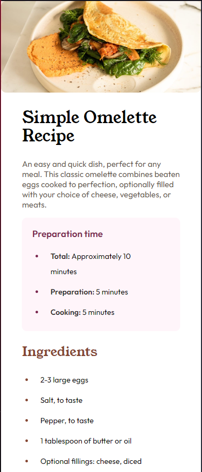
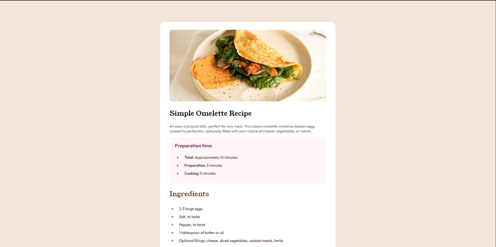

# Frontend Mentor - Recipe page solution

This is a solution to the [Recipe page challenge on Frontend Mentor](https://www.frontendmentor.io/challenges/recipe-page-KiTsR8QQKm). Frontend Mentor challenges help you improve your coding skills by building realistic projects.

## Table of contents

- [Overview](#overview)
  - [Screenshot](#screenshot)
  - [Links](#links)
- [My process](#my-process)
  - [Built with](#built-with)
- [Author](#author)

## Overview

This is a small project about a recipe webpage where I use HTML semantico and CSS

### Screenshot

### Links

- Solution URL: [Github](https://github.com/forneiro/recipe-page-main)
- Live Site URL: [Netlify](https://forrecitepage.netlify.app)

## My process

### Built with

- Semantic HTML5 markup
- CSS custom properties

## Author

- Github - [Forneiro](https://github.com/forneiro)
- Frontend Mentor - [@forneiro](https://www.frontendmentor.io/profile/forneiro)
- Linkedin - [Nicolás Forneiro](https://www.linkedin.com/feed/)
